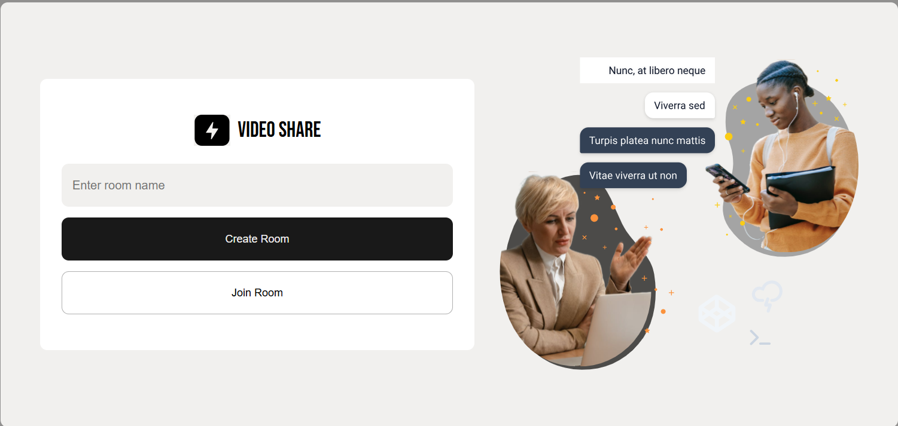
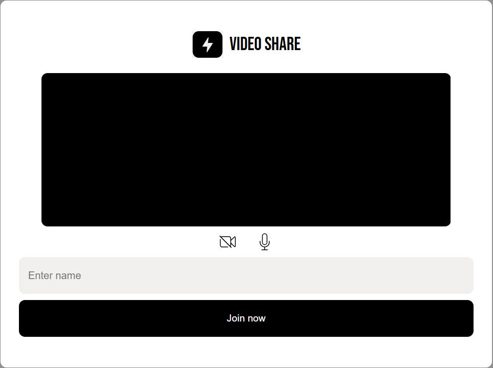

#



# WebRTC Video Calls and Chat App 📹💬

A simple peer-to-peer video calling and chat application built with WebRTC, Express, and Socket.IO — no third-party services used.

---

## 🚀 Features

- One-on-one video calling
- Real-time chat
- No third-party dependencies like Firebase or Twilio
- Powered by WebRTC and Socket.IO

---

## 🔗 Live Demo

[demo](https://video-share-uju2.onrender.com)

---

## 🛠️ Technologies Used

- Node.js
- Express.js
- WebRTC
- Socket.IO

---

## 📦 Installation Guide

### 1. Clone the Repository

```bash
git clone https://github.com/Pkson13/Video_share.git
cd Video_share
```

> ### ⚠️ This project uses [mkcert](https://github.com/FiloSottile/mkcert) for local HTTPS. To generate your own certificates, make sure you have it installed then run:

```bash
mkcert -install
mkcert cert
```

### 2. Install Dependencies

Make sure you have **Node.js** installed. Then run:

```bash
npm install
```

### 3. Run the App

```bash
npm start
```

This will start the server with **nodemon** and listen on your port 8000.

### 4. Open in Browser

```
https://localhost:8000/index.html
```

---

## 📱 How to Use

### Step 1: Initiate a Call

- Open the app in a browser (e.g., `http://localhost:8000/index.html`)
- Enter the **room Name**
- Click the **Create Room** button  
  You will be redirected to a waiting screen.

### Step 2: Join a Call


- Open the same app in another browser window or on another device
- Enter the **room Name**
- Click the **Join Room** button
  

## 🔧 Running the App on Other Devices (Local Network Access)

To allow other devices (like your phone or another laptop) to access the app on your local network, you’ll need to update the **CORS settings** in your `index.js` file.

### Locate This Block in `index.js`

```js
const io = new Server(httpsServer, {
  cors: {
    origin: [
      "https://localhost:8000",
      "https://192.168.88.181:8000",
      // 👇 Add your local development IP address here
    ],
  },
});
```

## 🧠 Notes

- This app does **not** use a database. All user data exists only during the session.
- Make sure both users are online at the same time.
- The server must stay running for signaling via Socket.IO.

---

## WebRTC Offer/Answer Process (Without ICE Layer)

The offer/answer process is performed both when a call is first established, and any time the call's format or configuration changes.

### 📞 Caller Side (Initiator)

1. **Capture Local Media**
   Uses `navigator.MediaDevices.getUserMedia()` to get audio/video streams.

2. **Create Peer Connection**
   Creates an `RTCPeerConnection` object.

3. **Add Media Tracks**
   Calls `RTCPeerConnection.addTrack()` to attach media tracks (since `addStream()` is deprecated).

4. **Create Offer**
   Calls `RTCPeerConnection.createOffer()` to create an SDP offer.

5. **Set Local Description**
   Calls `RTCPeerConnection.setLocalDescription(offer)` to set the offer as the local description.

6. **Gather ICE Candidates**
   After setting local description, ICE candidates are gathered via STUN servers.

7. **Send Offer**
   Uses a signaling server to transmit the offer to the recipient.

---

### 🎧 Recipient Side (Answerer)

8. **Set Remote Description**
   Receives the offer and calls `RTCPeerConnection.setRemoteDescription(offer)`.

9. **Capture Local Media**
   Captures local media using `getUserMedia()`.

10. **Add Media Tracks**
    Calls `addTrack()` to attach local media tracks to its peer connection.

11. **Create Answer**
    Calls `RTCPeerConnection.createAnswer()` to generate an SDP answer.

12. **Set Local Description**
    Calls `RTCPeerConnection.setLocalDescription(answer)`.

13. **Send Answer**
    Uses signaling server to send the answer back to the caller.

---

### 🔁 Final Steps (Caller)

14. **Receive Answer**
    Caller receives the answer from the signaling server.

15. **Set Remote Description**
    Calls `RTCPeerConnection.setRemoteDescription(answer)`.

✅ **Connection is now fully established**, and media begins to flow between the peers.

# offer type

```typescript
type offer = {
  socketid: string;
  offer: {};
  offerer_name: string;
  offerericecandidates: IceCandidate[];
  answerer_socket_id: string;
  answer: {};
  answerericecandidates: IceCandidate[];
};
```

## 📁 Project Structure

```
/Video_share
│
├── index.js             # Entry point
├── /public              # Static files (HTML, CSS, JS)
├── package.json         # Dependencies & scripts
└── README.md            # Project documentation
```

---

## ✨ Contributing

Feel free to fork the repo, make changes, and submit a pull request!

---

## 📧 Contact

**Author:** Peterson Kinyanjui  
📬 Email: kinyanjuipeterson5473@gmail.com

---

## 📄 License

This project is licensed under the [ISC License](https://opensource.org/licenses/ISC).

---
